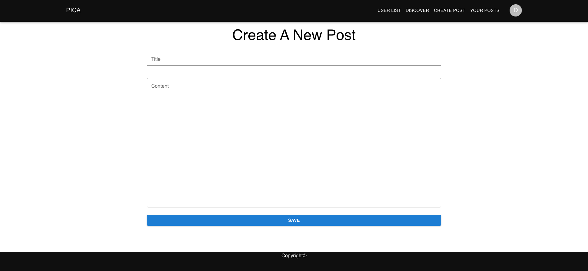

# 4. Assigments: 
This is an Blog website which user can make a register to website and login.
After login, user can create own posts and read other users posts.
User can delete and edit own posts.

## Tech
Frontend: React, Axios, Redux
Backend: NodeJS, Express, TypeScript, TypeORM, MySQL, JWT

## Setup
npm version 14^
## Client
Under client folder directory run this comment "npm install"
After all needed packages donwload, run "npm start" to run client side project.

## Server
Under client folder directory run this comment "npm install".
DB connections information is required in the ormconfig.js file. Before running the project you need to enter your connection info in the file. 

Also, create an JWT_Secret info, it is required in the project. 

## Home Page

## Sign in Page

## Signup Page

## Home Page After Login

## User List Page

## Discover Page

## User Posts

## Post

## Create Post

## Update Post
